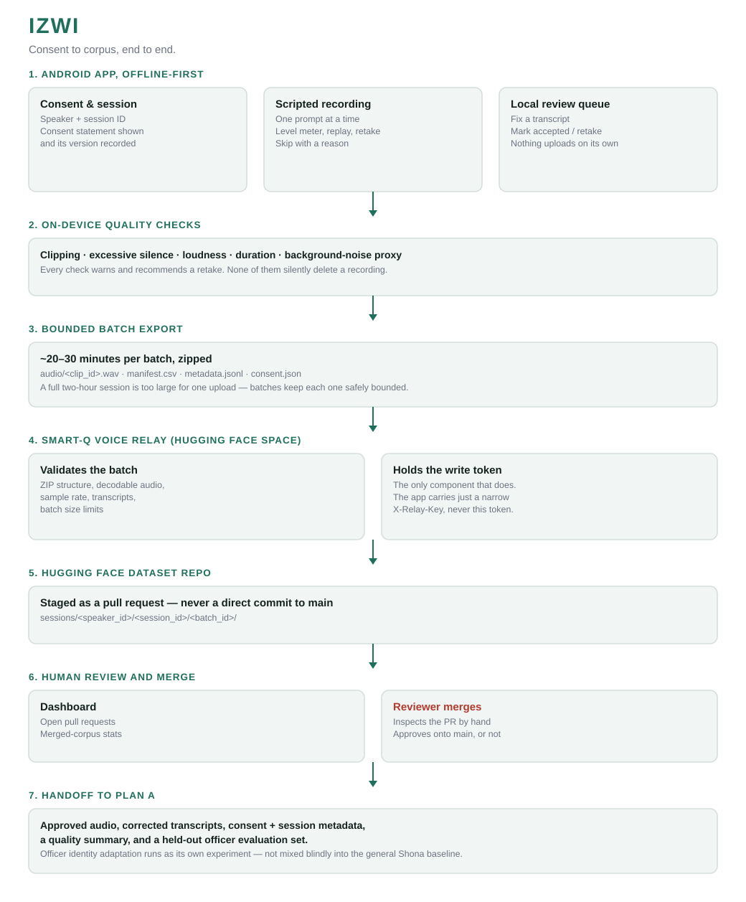

# Izwi

[](https://github.com/Quantilytix/izwi_collect/releases/latest/download/app-debug.apk)
[](https://github.com/Quantilytix/izwi_collect/releases/latest)

`izwi` is Shona for "voice." Offline-first capture of Smart-Q's production Shona voice, recorded from a single consented speaker in Zimbabwe. Sibling of [Injini](https://github.com/rapha18th/injini), Smart-Q's acoustic-monitoring app, and built on the same field-tested pattern: record offline, review before anything leaves the phone, sync only when told to, stage every upload as a pull request, let a person merge it.

The link above always points at the current release. Download it straight to a phone, allow installs from the browser or file manager when asked, and install. Debug-signed, no Play Store, this is an internal-recording build.

## The idea

Smart-Q's voice replies need a Shona voice its users already recognise. Two tracks feed that goal: an internal benchmark measuring the best Shona TTS buildable today from existing open datasets and checkpoints, and Izwi, the actual production track, capturing a real Smart-Q speaker's voice under explicit consent, staged and reviewed before it ever trains anything.

The app borrows Injini's proven shape rather than inventing a new one: offline-first recording, visible capture feedback, a local queue and retry, an explicit sync action, metadata-rich exports, server-side validation, Hugging Face pull-request staging, and human review before data enters the training branch. It shares none of Injini's machine-monitoring concepts.

**Consent screen note.** The consent gate is switched off for this internal recording pass — `SessionSetupActivity` is the launcher and just takes a speaker ID. `ConsentActivity` and its full consent copy are kept in the codebase untouched and get wired back in as the launcher the moment this ships to a public or external speaker.

## Architecture

Consent to corpus, end to end.



## The pipeline

| Stage | What | Where |
|---|---|---|
| Session setup | Speaker ID, session ID, script version | `SessionSetupActivity.kt` (consent-gated `ConsentActivity.kt` kept for later) |
| Recording | Mono PCM WAV, 24 kHz preferred, 16 kHz fallback, live level meter | `WavRecorder.kt`, `LevelMeterView.kt` |
| Quality checks | Clipping, excessive silence, loudness, duration, background-noise proxy — warns, never deletes | `QualityAnalyzer.kt` |
| Review queue | Transcript correction, accept/retake toggle, session summary | `ReviewQueueActivity.kt` |
| Export | Bounded ~20–30 minute zip batches: `audio/`, `manifest.csv`, `metadata.jsonl`, `consent.json` | `BatchExporter.kt` |
| Upload | Relay call authenticated by a narrow `X-Relay-Key`, WorkManager retry on one enqueued attempt, never automatic | `RelayClient.kt`, `UploadWorker.kt` |
| Relay | Validates structure, audio, sample rate, and transcripts; opens a pull request; holds the only HF write token | `../smart-q-voice-relay` (FastAPI, Hugging Face Space) |
| Dataset | Every batch lands as a PR under `sessions/<speaker_id>/<session_id>/<batch_id>/`, never a direct commit | `rairo/smart-q-shona-voice-corpus` (private) |
| Dashboard | Open PRs and merged-corpus stats, read-only | `../smart-q-voice-dashboard` (Streamlit, Hugging Face Space) |

## Verified on device

Tested end to end on a physical Android phone, 2026-09-17: session setup, recording, on-device quality analysis, review queue, bounded batch export, and relay upload, confirmed against a real pull request on the dataset repo (closed afterward — it was a rehearsal pass, not real speech).

That pass caught three real bugs, now fixed: the `DayNight` theme rendered body text invisible against a background forced to white; `android:attr/borderlessButtonStyle` under `MaterialComponents` rendered every enabled text button white-on-white; and a stale quality warning survived tapping Retake.

Not yet done: an actual recording session with the real speaker reading real prompts (this pass only exercised the pipeline mechanically), and a full ten-clip go/no-go rehearsal.

## Android: from consent to corpus

**Session setup** takes a speaker ID and starts a session; it resumes safely if the app restarts mid-session. **Recording** shows one prompt at a time with a live level meter, replay, retake, and skip-with-reason. **Review** lets you fix a transcript or flag a clip for retake before anything leaves the phone. **Sync** is a single explicit action — nothing uploads on its own — and shows the resulting pull request URL once the relay accepts a batch.

A one-page printable guide for the speaker is in [`docs/onboarding`](docs/onboarding/Izwi_Recording_Voice.pdf).

Build from source:

```bash
./gradlew assembleDebug
adb install -r app/build/outputs/apk/debug/app-debug.apk
```

`local.properties` needs `sdk.dir`, `relay.baseUrl`, and `relay.apiKey` — the relay key is a narrow upload credential, never an HF token, baked into `BuildConfig` at build time.

## Limitations

- The seed script (`app/src/main/assets/script_v1.json`, 40 prompts) is machine-drafted and explicitly flagged in its own `note` field as unverified Shona. It needs a native speaker's review and expansion toward a 1,000–1,800 utterance target before a real session.
- All three Hugging Face resources (dataset, relay, dashboard) live under the `rairo/` personal namespace, not `quantilytix/` as originally planned — the available token wasn't scoped to the org. Transfer once an org-scoped token exists.
- The consent copy in `ConsentActivity` covers purpose, use, storage, retention, withdrawal, scope, and disclosure, but hasn't been reviewed by counsel, and isn't active in the current build (see the consent screen note above).
- App icon is a placeholder vector mark, not a designed brand asset.

## Licences

Code is MIT. The corpus this app produces is not openly licensed — it is consent-scoped to Smart-Q under the terms shown on the (currently disabled) consent screen, not a redistributable dataset.
